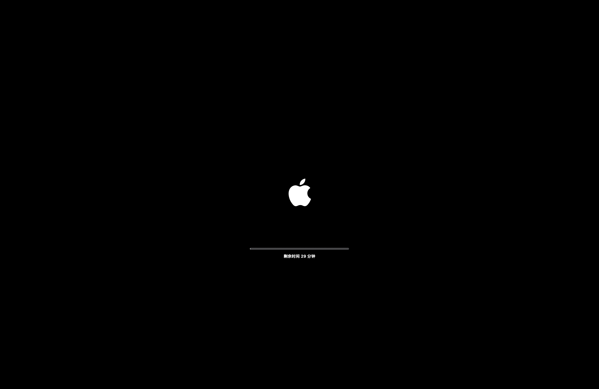

# 摸了个鱼

macOS 摸鱼模拟器，可以模拟系统升级，为摸鱼打掩护！

## 预览

## 免责声明

我们不对使用本程序造成的任何后果承担任何责任。下文中，我们列出了一些可能发生的内容，请悉知。

- 计算机死机，卡顿，重启。
- 计算机芯片烧毁。
- 花屏，白屏，黑屏，闪屏 。
- 被老板看到你在摸鱼。
- 被辞退。
- 变得不幸。
- **变成猫猫。**
- 地球爆炸。
- 宇宙重启。

## 使用许可

本程序及其源码和编译产物附属[MIT](LICENSE)许可，其生成展示的内容与相关图标和符号不做许可承诺，请参考他们的原始许可。

**请不要售卖本程序。因为这样做会有人受伤。**

🥺

---

Copyright © 2021 Lakr Aream. All Rights Reserved.
